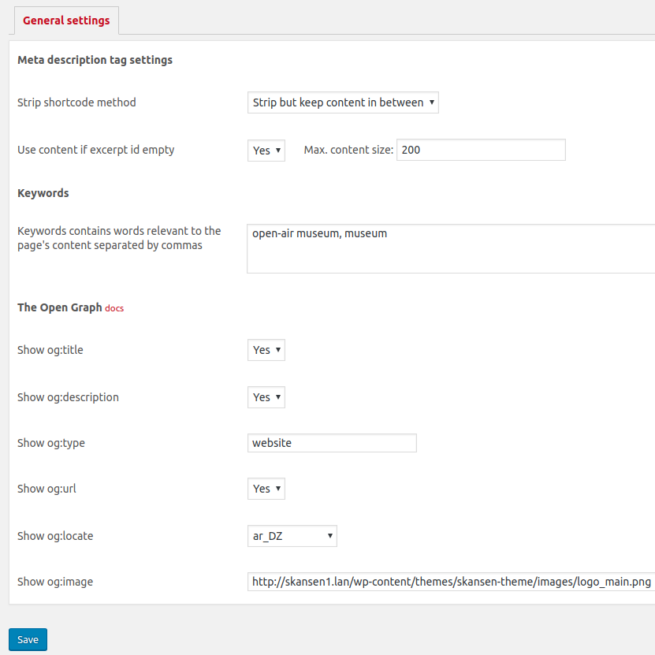

# Gold SEO

[Homepage](https://tkonopelski.github.io/wp-gold-seo/)

### Welcome to the Gold SEO GitHub repository

Gold SEO is a simple plugin to add meta description in the header of your WordPress blog.
For meta description plugin uses excerpt (wp post excerpt) and if he does not find excerpt, it uses post content.
The post content for description is striped from HTML tags and truncated (max size can be changed in the settings page).

Also, there is a few methods for dealing with shortcodes, available options are:
 * No strip
 * Strip all	
 * Strip but keep content in between

Plugin supports The Open Graph protocol, available options are:
* og:title
* og:description
* og:type
* og:url
* og:locate
* og:image

## Installation

1. Upload to the `/wp-content/plugins/` directory
2. Activate the plugin through the 'Plugins' menu in WordPress
3. Visit `Settings > Gold SEO` to begin setting up the plugin.

## How to use

After installation go to Settings > Gold SEO and check your settings.

## Changelog

* 1.4 (2019.01.16)
    + fixed og:url meta tag

* 1.3 (2019.01.09)
    + Hide Generator Meta Tag
    + Data Sanitization/Escaping fixes

* 1.2
    + Open Graph protocol support
    + minor fixes

* 1.1
    + Initial release.
